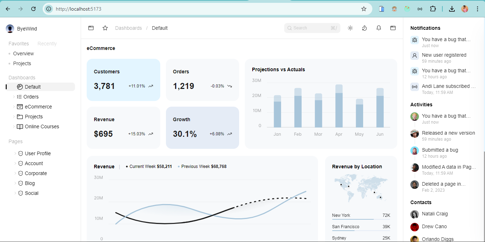
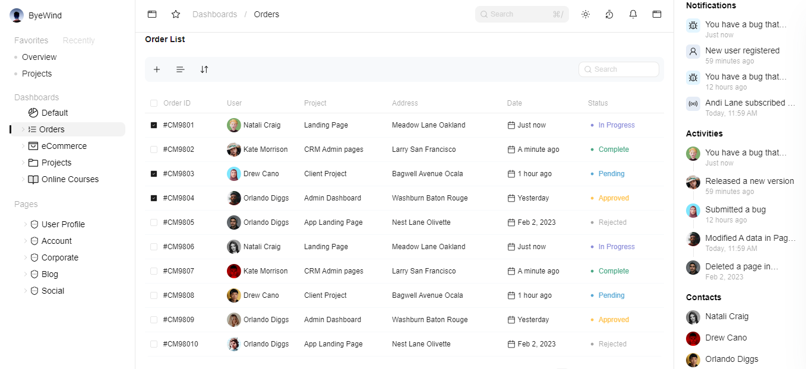

# SaaS Dashboard

A pixel-perfect SaaS dashboard built using React. The project strictly follows design specifications, ensures responsiveness, and adds meaningful motion and microinteractions for an enhanced user experience.

## 🌟 Features

- **Pixel-Perfect Implementation**: The UI matches the Figma designs with precise layout, spacing, typography, colors, and alignment.
- **Responsive Design**: Optimized for various devices including desktop, tablet, and mobile.
- **Reusable Components**: Clean and modular code with a focus on reusability.
- **Smooth Animations**: Added microinteractions and animations for a more engaging user experience using `framer-motion`.

## 🛠️ Tech Stack

- **React**: Frontend library for building user interfaces.
- **React Router**: For client-side routing.
- **CSS Modules/Tailwind CSS**: For styling.
- **Framer Motion**: For animations and microinteractions.
- **State Management**: Using Redux Toolkit for handling application state.


## Snapshots
####  Default Dashboard layout


#### Order List Page


### Dark Mode


## 🚀 Getting Started

Follow these instructions to set up and run the project locally.

## Installation

To run this project locally, follow these steps:

1. **Clone the repository:**
    ```bash
    git clone https://github.com/Keegan-20/juspay-assignment
    ```

2. **Navigate to the project directory:**
    ```bash
    cd your-repository
    ```

3. **Install the dependencies:**
    ```bash
    npm install
    ```

4. **Run the application:**
    ```bash
    npm run dev
    ```
